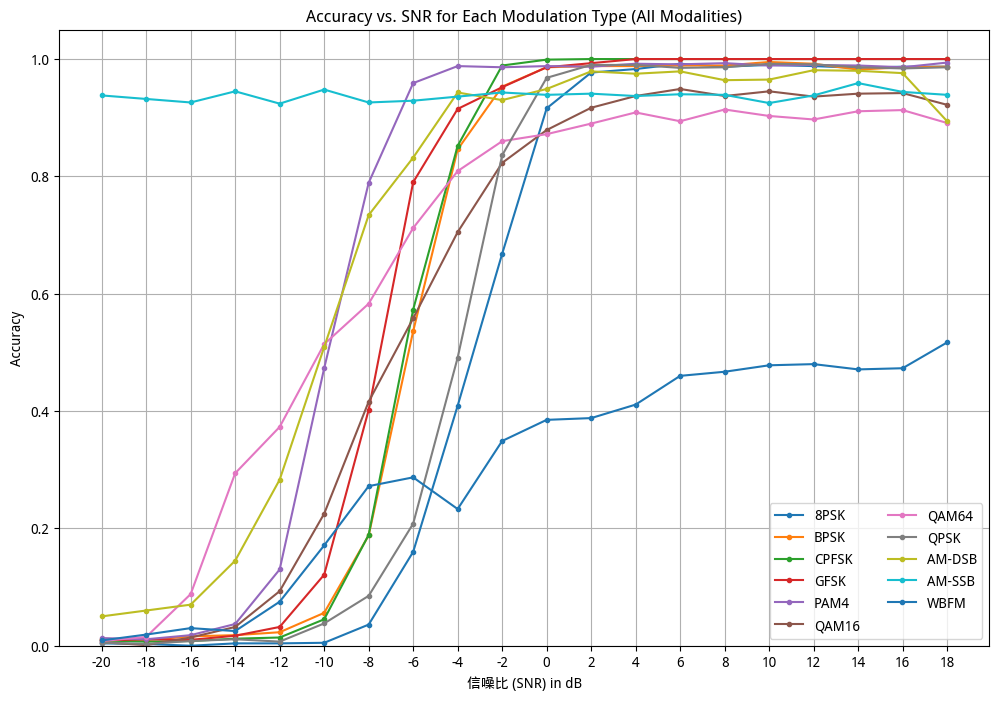
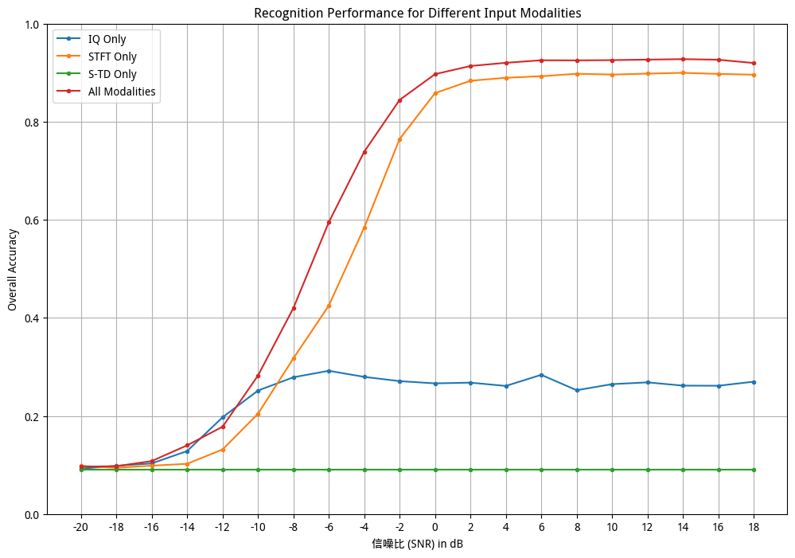
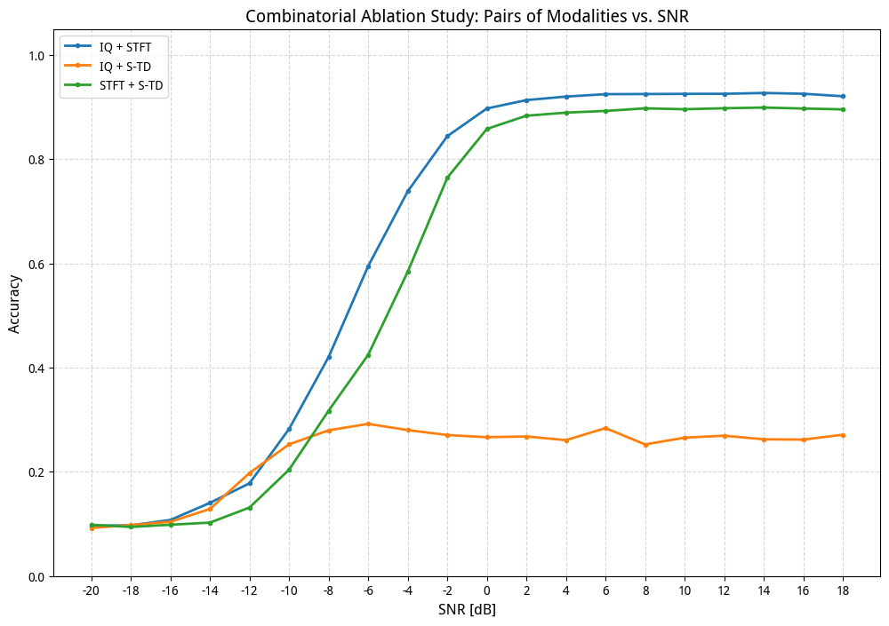
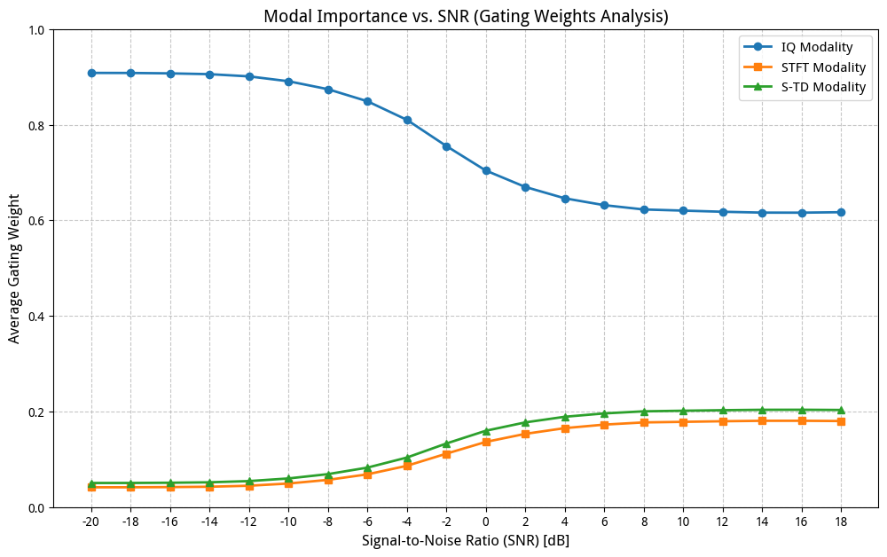

# amc-amr-gff-nn

AMC AMR Gated Fusion Former 自動調變識別神經網路。  
AMC AMR Gated Fusion Former neural network for automatic modulation recognition.

---

## 概述 | Overview

AMR_GateFusionFormer 神經網路的正式版本。門控機制作為訊號雜訊比感知的路由系統，在高 SNR 條件下優先使用頻率特徵（STFT），在強雜訊條件下優先使用結構保持特徵（S-TD/IQ）。  
Production version of the AMR_GateFusionFormer neural network. The gating mechanism functions as a signal-to-noise ratio-aware routing system, prioritizing frequency features (STFT) under high SNR conditions and structural preservation features (S-TD/IQ) under heavy noise conditions.

---

## 類別與狀態 | Category and Lifecycle

- **類別 | Category**：Development
- **類型 | Type**：Deep Learning | Neural Network
- **生命週期 | Lifecycle**：stable
- **標籤 | Tags**：deep-learning, neural-network, gated-fusion-former, automatic-modulation-recognition

---

## 結構 | Structure

```text
Development/amc-amr-gff-nn/
├── assets/
├── src/
│   ├── __init__.py
│   ├── run.py                 # CLI / subcommands entrypoint
│   ├── export.py              # Model export / ONNX / TorchScript (optional)
│   ├── utils.py               # Shared utilities (IO, plotting, metrics)
│   ├── configs/
│   │   └── config.py          # Default settings / hyperparams
│   ├── core/                  # Analysis/experiment modules
│   │   ├── dataset.py
│   │   ├── evaluate.py
│   │   ├── deep_analysis.py
│   │   ├── ablation.py
│   │   ├── gating_weights.py
│   │   └── cnn_vs_transformer.py
│   └── models/
│       ├── factory.py         # build_model(...)
│       ├── model.py
│       ├── gff_nn.py
│       └── cnn2.py / mod_rec_net.py
├── README.md
```

---

## 如何執行 | How to Run

所有腳本共用相同的兩個必要參數：  
All scripts share the same two required parameters:

| 參數 | 說明 |
|------|------|
| `--weights` | 訓練完成的模型權重檔（.pth）— 必填。Trained model weights file (.pth) — required. |
| `--data` | RML2016.10a_dict.pkl 的完整路徑 — 必填。Full path to RML2016.10a_dict.pkl — required. |

選用參數 | Optional parameters:

| 參數 | 預設值 | 說明 |
|------|--------|------|
| `--batch-size` | 256 | 推理批次大小。Inference batch size. |
| `--output-dir` | `outputs` | 圖表輸出目錄。Chart output directory. |
| `--device` | auto | `cpu` 或 `cuda`（自動偵測）。`cpu` or `cuda` (auto-detected). |

---

## 相依項目 | Dependencies

```bash
pip install torch torchvision timm scipy scikit-learn matplotlib seaborn tqdm pandas
```

**資料集 | Dataset**：本專案使用 [RadioML 2016.10a (RML2016.10a)](https://www.deepsig.ai/datasets)。下載並解壓縮後，以 `RML2016.10a_dict.pkl` 作為 `--data` 參數。  
This project uses [RadioML 2016.10a (RML2016.10a)](https://www.deepsig.ai/datasets). After downloading and extracting, use `RML2016.10a_dict.pkl` as the `--data` parameter.

---

## 輸出與展示 | Outputs and Demos

所有圖表、視覺化結果、CSV 與 logs 儲存於 `--output-dir` 指定目錄（預設 `outputs/`）。  
All charts, visualizations, CSVs, and logs are saved in the directory specified by `--output-dir` (default `outputs/`).

### 基本模型評估 | Basic Model Evaluation (`evaluate.py`)

```bash
python src/run.py evaluate --weights path/to/model.pth --data path/to/RML2016.10a_dict.pkl --batch-size 256
```

**輸出 | Outputs:**
- `confusion_matrix_counts.png` — 原始計數混淆矩陣 | Raw count confusion matrix
- `confusion_matrix_normalized.png` — 歸一化混淆矩陣 | Normalized confusion matrix
- `accuracy_vs_snr.png` — 整體 Accuracy vs SNR

### 深度性能分析 | Deep Analysis (`deep_analysis.py`)

```bash
python src/run.py deep_analysis --weights model.pth --data RML2016.10a_dict.pkl
```

**輸出 | Outputs:**
- `per_class_accuracy_vs_snr.png` — 各類別 Accuracy vs SNR
- `confused_categories_high_snr.png` — 高 SNR 易混淆類別柱狀圖
- `tsne_visualization.png` — t-SNE 特徵空間可視化（低 / 高 SNR）




### 模態消融實驗 | Ablation Study (`ablation.py`)

```bash
python src/run.py ablation --weights model.pth --data RML2016.10a_dict.pkl
```

**輸出 | Outputs:**
- `ablation_single_modality.png` — 單模態消融 Accuracy vs SNR
- `ablation_pairwise_modality.png` — 成對模態消融 Accuracy vs SNR
- `ablation_confused_categories.png` — 高 SNR 易混淆類別對比




### 門控網絡權重分析 | Gating Weights Analysis (`gating_weights.py`)

```bash
python src/run.py gating --weights model.pth --data RML2016.10a_dict.pkl
```

**輸出 | Outputs:**
- `gating_weights_vs_snr.png` — IQ / STFT / S-TD 模態重要性 vs SNR



### CNN vs Transformer 對比（TODO）| CNN vs Transformer Comparison (TODO)

```bash
python src/run.py compare --weights model.pth --data RML2016.10a_dict.pkl
```

**輸出 | Outputs:**
- `gffnn_compare_acc.png` — 整體 Accuracy vs SNR 對比折線圖
- `gffnn_compare_overall.png` — 整體準確率柱狀圖

---

## 注意事項 | Notes and Limitations

- 可使用模組化方式執行 | Module run alternative:
  ```bash
  python -m src.run evaluate --weights ... --data ...
  ```
- 建議為 CLI subcommands 加入 unittest / pytest 以確保重構後行為一致。Apply unittest / pytest to CLI subcommands to ensure behavior consistency after refactoring.
- 建議將設定（超參數）移至 YAML/JSON 並進行版本追蹤，以確保實驗可重現。Move config (hyperparameters) to YAML/JSON with version tracking for reproducible experiments.

---

## 相關連結 | Related Links

- [專案 Catalog | Project Catalog](../../catalog/index.md)
- [Repository 根目錄 | Repository Root](../../README.md)
