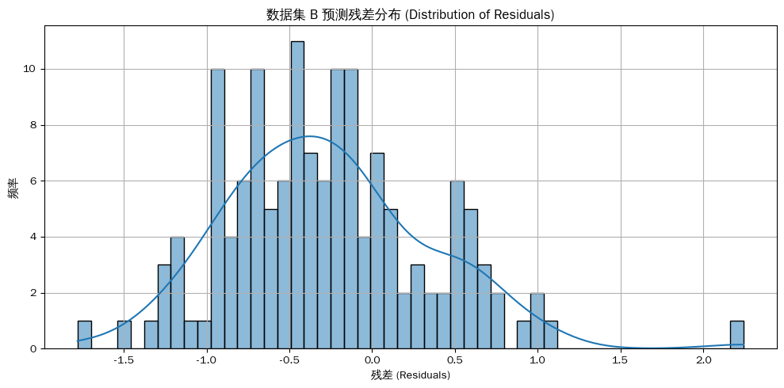
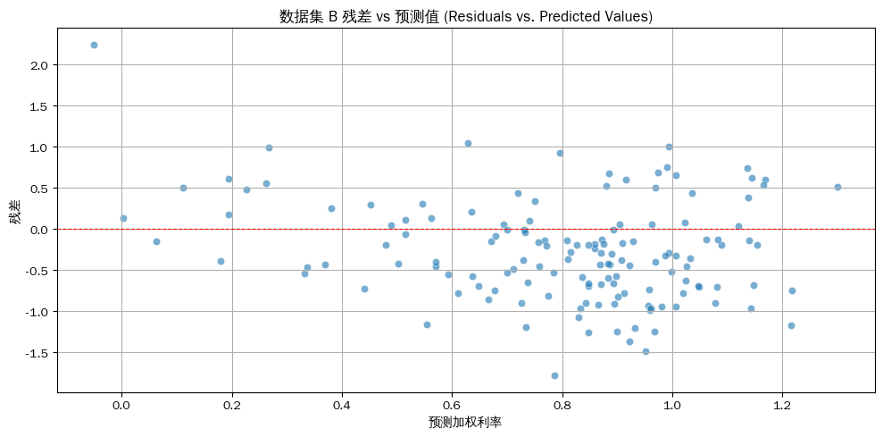

# cnogb-abnormal-intervention

使用 Transformer 模型進行債券預測與異常偵測。  
Bond forecasting and anomaly detection using Transformer models with weighted feature extraction.

---

## 概述 | Overview

本專案以 Transformer Encoder 與 PyTorch 建立債券利率預測示範模型，評估指標包含 R² 與 RMSE，並附有排列重要性分析。  
A bond interest rate forecasting demonstration built with Transformer Encoder and PyTorch, featuring evaluation metrics including R² and RMSE, plus permutation importance analysis.

---

## 類別與狀態 | Category and Lifecycle

- **類別 | Category**：Research
- **類型 | Type**：Transformer | Forecasting | Anomaly
- **生命週期 | Lifecycle**：stable
- **標籤 | Tags**：transformer, forecasting, anomaly, finance

---

## 結構 | Structure

```text
Research/cnogb-abnormal-intervention/
├── assets/                    # 結果視覺化 | Result visualizations
├── notebooks/              # Jupyter Notebook 檔案 | Jupyter notebooks
└── README.md               # 本文件 | This file
```

---

## 如何執行 | How to Run

1. 安裝相依套件 | Install dependencies:
   ```bash
   pip install torch numpy pandas scikit-learn matplotlib
   ```

2. 執行 Jupyter Notebook 以運行預測模型。  
   Run the Jupyter notebooks to execute the forecasting model.

3. 在 `assets/` 目錄查看結果。  
   View results in the `assets/` directory.

---

## 相依項目 | Dependencies

- PyTorch
- NumPy
- Pandas
- Scikit-learn
- Matplotlib

---

## 輸出與展示 | Outputs and Demos

### 模型結果 | Model Results

#### 預測資料圖 | Data with Predictions


#### 特徵重要性 | Feature Importance


#### MC Dropout 不確定性 | MC Dropout Uncertainty


#### 殘差分布 | Residuals Distribution


#### 殘差 vs 預測值 | Residuals vs Predicted


---

## 注意事項 | Notes and Limitations

- 本專案為研究示範，非正式生產用途。This is a research demonstration project, not intended for production use.
- 聚焦於使用 Transformer 架構進行債券利率預測。Focuses on bond interest rate forecasting using Transformer architecture.
- 包含 MC Dropout 不確定性量化。Includes uncertainty quantification via MC Dropout.

---

## 相關連結 | Related Links

- [專案 Catalog | Project Catalog](../../catalog/index.md)
- [Repository 根目錄 | Repository Root](../../README.md)
